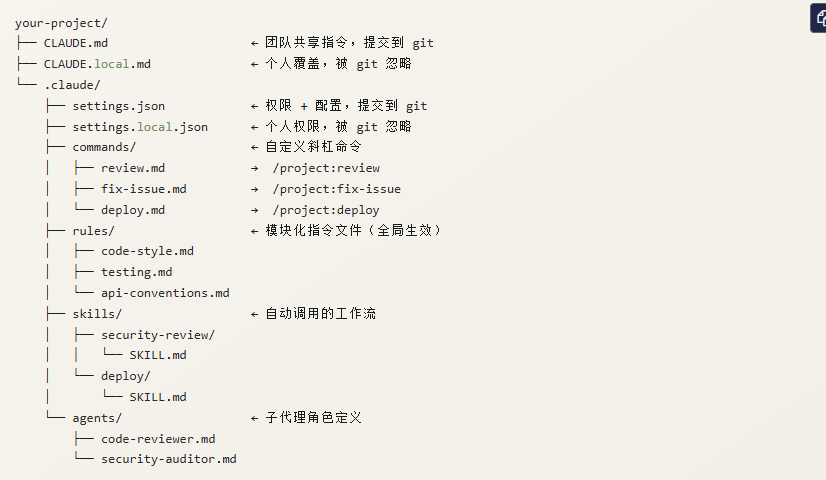

# 说明
本项目是将前端 后端 数据 运维等能力抽离成skill agent 并且主要的用户是学习agent  skill rules 等的书写.

# .claude 结构说明
 
 ## rules
将 CLAUDE.md 中的规则拆分模块化存放，Claude 在整个会话中始终遵守。适合存放长期稳定执行的行为约定，避免 CLAUDE.md 过于臃肿。
- rules/code-style.md
 ```
 - TypeScript 严格模式，禁用 any 类型
- 函数长度不超过 40 行，超出则拆分
- 优先使用 const，避免使用 let
- 导入顺序：标准库 → 三方包 → 本地模块
- 所有 export 的函数/类型需要 JSDoc 注释
- 禁止使用 console.log，使用项目 logger
 ```
 ## skills -  自动加载
Skills 是更高级的复合工作流。当 Claude 判断某个任务适合某个 skill 时，会自动读取并执行对应的 SKILL.md，无需手动调用。

每个 skill 是一个子目录，目录内包含 SKILL.md。

- skills/security-review/SKILL.md
```
---
name: 名称
description: 职责用于匹配用户的自然语言 匹配上则执行当前的skill
---

下面是当前skill的能力
```
 ## agent
定义可被主 Claude 实例派遣的专业子代理。在复杂任务中，主代理将子任务委派给对应专家角色，实现多代理协作。子代理在隔离上下文中运行，拥有独立的权限范围。

- agents/code-reviewer.md
```
---
name: code-reviewer
description: 资深代码审查员，专注代码质量与可维护性
---

# 代码审查员

## 角色定位
你是一名拥有 10 年经验的资深工程师，专注于代码可读性、性能优化和最佳实践。

## 审查重点
- 命名是否清晰表达意图
- 函数/类的单一职责原则
- 边界条件和错误处理
- 性能瓶颈（N+1 查询、不必要的循环等）

## 权限
只读访问，不直接修改文件。

## 输出格式
使用 Markdown 表格输出，包含：问题位置、严重程度、建议方案。

```
 ## script
  可执行的脚本
 ## commands
 每个md 文档都会被识别成指定 指令一般是团队将重复性任务标准化的核心机制
 commands/review.md
 ```
 请对当前修改执行完整的代码审查：

1. 检查是否有安全漏洞（SQL 注入、XSS 等）
2. 验证错误处理是否完整
3. 确认测试覆盖率是否达标
4. 检查是否符合代码风格规范
5. 评估性能影响

用中文输出结构化审查报告，按严重程度排列问题。
 ```

 ## referneces
 资源文档或者参考文档
 ## CLAUDE.md
 项目中的记忆文件 每次对话的时候claude 都会加载 了解规则和项目 如果超过100行的规则则进行规则拆分 放在rules 里面 可以按需加载
 ## settings.json
 工具开关模型偏好
 ## setting.local.json

 